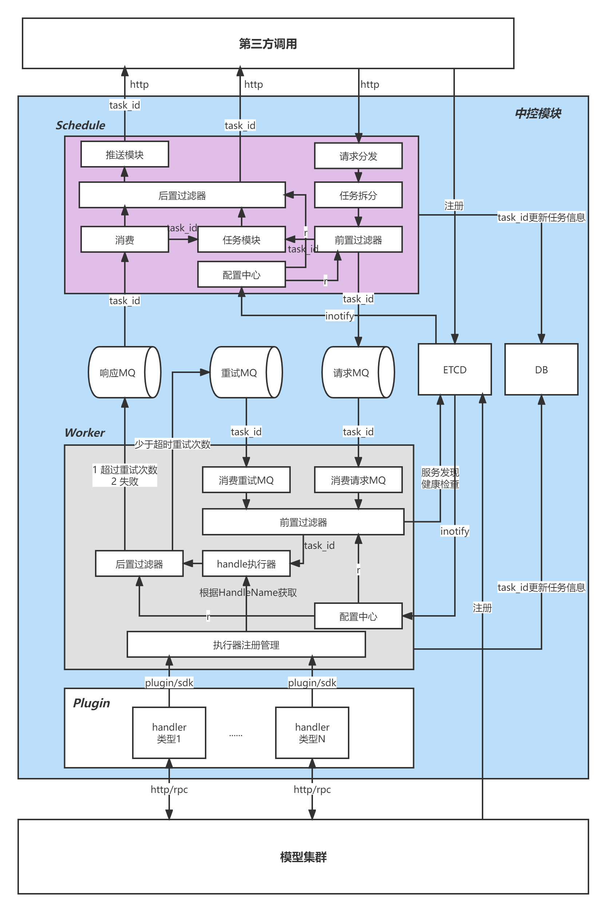

# scheduler
分布式调度任务，支持消息队列、超时重试、故障转移、任务依赖等功能


## 任务调度交互图
 


#### 分布式调度服务功能模块划分
+ Schedule：实现任务提交、任务推送、幂等、黑白名单、流控、任务拆分等；
+ Worker：任务队列、任务执行器，任务重试等；
+ Plugin: 指具体业务实现handler，通过sdk/plugin/grpc等方式注册到服务
+ Mysql：记录任务信息，包括状态以及进度；记录消费方的信息等
+ Etcd：服务注册与发现，配置中心
+ Kafka：消息队列，持久化请求信息以及响应数据，包含重试信息

#### MQ分类
+ 请求MQ：调用方发起的原始请求；响应
+ MQ：仅包括成功、失败、超时重试超过次数重试
+ MQ：超时响应且小于上限；

#### 过滤器
+ 前置过滤器
负载均衡、健康检查、熔断、rpc连接池
+ 后置过滤器
根据超时次数，判断是否重试MQ

#### 配置中心
+ 前置过滤器、后置过滤器
+ MQ配置（1）队列长度（2）消费间隔（3）重试时间间隔、重试次数

#### Handler实现方式
+ SDK，基于interface接口实现
+ Plugin，基于golang plugin机制
+ grpc交互实现

##### handler基于interface接口开发
```
type Job interface {	
   // 初始化实例信息	
   Init(param interface{})
   // 消费消息	
   Sub(event TopicEvent) 
   // ACK	
   ACK() <- chan TopicEvent	
   // 资源释放	
   Close()
}
```
##### handler基于rpc开发

```
service ScheduleHandleService {]
// 消费    
   rpc Pub(TopicInfo) returns (PubResponse) {}    
   // 响应    
   rpc Ack(AckReq) returns (stream TopicInfo) {}    
   // 心跳    
   rpc HeartBeat(HeartBeatRequest) returns (HeartBeatResponse) {}
}
```
